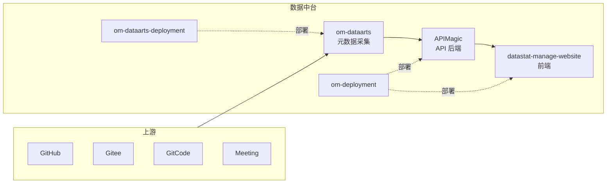

# 数据中台 架构文档

> 项目层架构总览。

## 1. 系统边界

数据中台对接 5 类上游：

- 各开源社区代码托管平台（GitHub / Gitee / GitCode）
- 社区 CI / CD 平台
- 社区 issue / PR / discussion 数据
- 社区会议 / 邮件列表 / Slack
- 外部 SaaS 工具（如 OSS Insight）

向外提供 1 类下游：

- 社区运营 / 治理 dashboard（datastat 网站）

## 2. 组件图

## 3. 数据模型

核心实体：`Community` / `Repo` / `Contributor` / `Event` / `Metric`，详见 `om-dataarts/docs/db-schema.md`（子仓内）。

## 4. 关键流程时序

- 元数据采集：定时任务 → om-dataarts pull → 入库 → APIMagic 暴露
- 数据展示：用户访问 datastat → APIMagic 聚合查询 → 返回 JSON → 前端渲染

## 5. 跨服务依赖

- `om-dataarts` → `APIMagic`：通过 DB 共享 + Kafka 事件
- `APIMagic` → `datastat`：REST API
- `om-deployment` / `om-dataarts-deployment`：操作 K8s API，不依赖业务服务

## 6. 可观测性埋点

- 采集任务：每社区每任务 QPS + 错误率 + 耗时
- API：4 金指标
- 前端：Web Vitals + 异常上报

## 7. 安全设计

- API 全部 OAuth2（社区 SSO）
- DB 凭据走 Vault sidecar
- PII（贡献者邮件 / 真实姓名）按数据分级脱敏存储

详见 [`credentials-inventory.md`](credentials-inventory.md)。

## 8. 关联

- 团队架构规范：[`../../../teams/standards/architecture.md`](../../../teams/standards/architecture.md)
- 项目 CLAUDE：[`../CLAUDE.md`](../CLAUDE.md)
