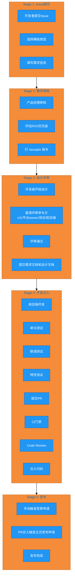
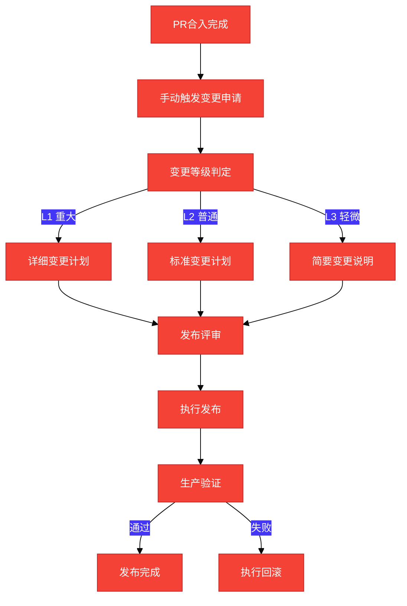

# GitHub Issue 全流程指南

## 目标受众

新入职开发者，帮助理解从提交Issue到最终发布的完整DevOps生命周期。

---

## 1. 基础概念速查

### 什么是Issue？

Issue是GitHub上的需求或问题跟踪单元，用于记录功能需求、Bug修复、技术改进等工作项。每个Issue对应一套完整的交付文档。

### 什么是PR？

Pull Request（PR）是代码变更的提交请求，包含代码改动、CI验证、Code Review等流程。

### 什么是CI？

Continuous Integration（CI）是持续集成自动化流程，在PR提交后自动执行构建、测试、扫描等检查。

### 需求相关性标签体系

| 标签 | 含义 | 触发条件 |
|------|------|----------|
| `need_security` | 需架构设计（含安全威胁分析） | 边界变更/凭证处理/权限调整/供应链/隐私/AI |
| `need_design` | 需架构设计 | A环节判定需安全设计/拓扑变更/API变更/新中间件 |
| `need_itest` | 需测试策略和集成测试 | 需安全或架构设计/跨组件影响/核心组件/环境依赖/端到端流程 |
| `need_ux` | 需UX设计 | 交互变更/性能变动/文档变更/无障碍 |
| `need_light` | 轻量化特性，走快速合入通道 | 以上均未勾选 |

---

## 2. 流程总览



---

## 3. 阶段详解

### Stage 1: Issue提交阶段

#### 流程规范

1. **提交入口**：
   - 访问团队 backlog 仓（`opensourceways/backlog`）
   - 点击 Issues 页面 → 点击 "New Issue" 按钮
   - 根据需求类型选择对应的Issue模板
2. **选择模板**：根据需求类型选择合适的Issue模板
   - **Feature Request**：新功能需求
   - **Bug Report**：问题修复需求
3. **填写信息**：
   - 需求背景：描述问题场景和痛点
   - 需求详情：具体的功能描述或问题描述
   - 预期价值：实现后的收益

#### 最佳实践

- 填写完整信息，避免空Issue提交
- 关联正确的仓库（如backlog仓库用于基础设施需求）
- 标题清晰明了，便于快速理解需求内容

#### 检查清单

- [ ] 已选择正确的Issue模板
- [ ] 需求背景描述完整
- [ ] 需求详情清晰具体
- [ ] 预期价值已说明

---

### Stage 2: 需求审核阶段

#### 流程规范

1. **审核责任人**：产品经理
2. **审核标准**：
   - 范围判定：是否属于基础设施范围内
   - 规划一致性：是否在年度技术规划中
   - 优先级：高/中/低评估
   - ROI评估：工作量与价值匹配度
3. **审核指令**：产品经理在Issue评论区打 `/accepts` 指令
4. **审核结果**：
   - **Accept（准入）**：需求进入开发准备阶段
   - **Reject（驳回）**：需求不满足准入标准
   - **Pending（待议）**：需要更多信息或讨论

#### 最佳实践

- 开发者关注Issue评论区，及时响应审核意见
- 如审核结果为Pending，及时补充缺失信息
- 审核通过后方可进入设计阶段

#### 检查清单

- [ ] 产品经理已审核
- [ ] 审核结果为Accept
- [ ] Issue已打上相关标签

---

### Stage 3: 设计评审阶段

#### 流程规范

1. **设计责任人**：开发负责人
2. **评审参与方**：
   - UX设计师（交互设计评审）
   - 平台owner（架构评审）
   - 测试人员（测试策略评审）
   - 前端开发（前端设计评审）
   - 后端开发（后端设计评审）
3. **产出文档**：

| 文档类型 | 触发条件 | 存放路径 |
|----------|----------|----------|
| 需求分析说明书 | 所有需求必须 | `issue_docs/{issueId}/Requirement Analysis/` |
| 架构设计说明书 | `need_security` 或 `need_design` | `issue_docs/{issueId}/Architecture Design/` |
| 测试策略 | `need_itest` | `issue_docs/{issueId}/Test/` |
| UX设计 | `need_ux` | `issue_docs/{issueId}/Docs/` |

4. **文档命名规范**：`#{issueId} Requirement Analysis Specification.md`
5. **评审通过条件**：各参与方确认设计方案无异议

#### 最佳实践

- 设计前先阅读模板，严格遵循模板结构
- 需求相关性分析勾选时必须给出原因
- 任务拆解控制在2-4个，工作量紧凑实际
- 验收标准必须可量化、可测试

#### 检查清单

- [ ] 需求分析说明书已完成
- [ ] 相关性分析标签已打
- [ ] 触发的额外文档已完成（架构设计/测试策略/UX设计）
- [ ] 评审参与方已邀请且评审通过
- [ ] 文档已提交到 `issue_docs/{issueId}/` 目录

#### AI辅助工具

设计评审通过后，可使用AI工具辅助文档生成和PR检视：

**1. 生成设计文档**

在Claude Code环境中使用以下命令自动生成设计文档：
```
/ai-design {issueId}
```

例如：`/ai-design 100` 会自动生成Issue #100的需求分析说明书、架构设计说明书等文档。

**2. PR代码检视**

PR提交后，使用以下命令进行结构化代码检视：
```
/code-review {PR编号}
```

例如：`/code-review 123` 会自动对PR #123进行代码检视，输出分级检视报告（高/中/低）。

---

### Stage 4: 开发合入阶段

#### 流程规范


#### 子流程详解

**1. 前后端开发**
- 根据设计文档实现功能
- 遵循代码规范和安全编码规范

**2. 单元测试**
- 编写覆盖核心逻辑的单元测试
- 测试覆盖率满足门禁要求

**3. 联调测试**
- 前后端联调验证功能
- 本地环境验证通过

**4. 特性测试**
- 找测试人员进行特性测试
- 测试人员确认功能满足验收标准

**5. 提交PR**
- PR标题规范：`[{Issue类型}] #123 需求简述`
- PR描述关联Issue：`Fixes #xxx`
- PR描述包含变更说明、测试方法

**6. CI门禁与合入检查**

PR提交后会自动触发CI检查和合入检查，可通过以下指令手动触发重新检查：

| 指令 | 功能说明 | 使用场景 |
|------|----------|----------|
| `/retest` | 重新运行CI门禁 | CI失败后修复代码，需要重新触发CI检查 |
| `/check-pr` | 重新检查PR合入受阻原因 | PR长时间无法合入，需要排查阻塞原因 |
| `/check-cla` | 重新检查CLA签署状态 | CLA签署状态异常或未识别签署 |
| `/check-issue` | 重新检查Issue关联标签 | 需要验证PR是否正确关联Issue、标签是否完整 |

**必须通过项**：
- 构建：代码编译成功
- 单元测试：测试通过且覆盖率满足要求
- SAST扫描：无安全漏洞告警
- CLA签署：贡献者协议已签署
- Issue关联：PR已关联正确的Issue

**CI失败处理**：
- 查看Actions日志定位问题
- 修复后使用 `/retest` 重新触发CI
- 若合入受阻，使用 `/check-pr` 排查原因

**7. Code Review**

**AI辅助Review**：
在PR评论区输入以下指令，可快速获得AI Review能力：

| 指令 | 功能说明 |
|------|----------|
| `/oc prompt` | 使用Opus Claude进行代码Review，输出结构化检视意见 |
| `/gemini review` | 使用Gemini进行代码Review，提供代码质量建议 |

**Review响应规范**：
- 响应每个Review意见，说明处理方式
- Request Changes时必须修改后再次请求Review
- AI Review意见也需要认真对待和响应

**8. 合入代码**

**合入要求**：
- 需要获得 **2个 `/lgtm`**（Looks Good To Me）
- 需要获得 **1个 `/approve`**
- 所有CI通过
- 无合并冲突
- 选择合适的合入策略（Merge/Squash/Rebase）

#### 最佳实践

- 开发过程中保持feature分支与主分支同步
- CI失败第一时间处理，不要堆积
- Review意见逐条响应，保持讨论专业礼貌
- 合入前再次确认所有检查项通过

#### 检查清单

- [ ] 前后端开发完成
- [ ] 单元测试通过，覆盖率满足要求
- [ ] 联调测试通过
- [ ] 特性测试通过
- [ ] PR已提交且描述完整
- [ ] CI全部通过
- [ ] 已获得2个 `/lgtm`
- [ ] 已获得1个 `/approve`
- [ ] 代码合入完成

---

### Stage 5: 发布阶段

#### 流程规范



#### 变更等级判定

| 等级 | 定义 | 示例 | 文档要求 |
|------|------|------|----------|
| L1 | 重大变更，影响核心功能 | 数据库Schema修改、网络拓扑调整 | 详细变更计划 + 测试报告 |
| L2 | 普通变更，影响单一服务 | 新功能上线、配置变更 | 标准变更计划 |
| L3 | 轻微变更，影响有限 | Bug修复、代码清理 | 简要变更说明 |

#### 发布流程

1. **手动触发变更申请**：PR合入前，手动提交发布变更申请
2. **PR合入触发正式发布申请**：PR合入后自动触发正式环境变更申请
3. **变更计划说明书**：发布前完成，存放 `issue_docs/{issueId}/Release/`
4. **发布执行**：按变更计划执行发布步骤
5. **生产验证**：发布后执行验证清单，发现问题快速回滚

#### 最佳实践

- 根据变更影响范围判定变更等级
- 发布前完成变更计划说明书
- 发布过程中保持操作记录可追溯
- 发布后及时验证，发现问题立即回滚

#### 检查清单

- [ ] 变更申请已手动触发
- [ ] 变更等级已判定
- [ ] 变更计划说明书已完成
- [ ] 发布评审通过
- [ ] 发布执行完成
- [ ] 生产验证通过

---

## 4. 流程状态流转表

| 阶段 | 状态 | 触发条件 | 产出物 | 下一阶段 |
|------|------|----------|--------|----------|
| Issue提交 | 待审核 | Issue创建 | Issue记录 | 需求审核 |
| 需求审核 | 审核中 | Issue提交 | 审核结论 | 设计评审（Accept） |
| 设计评审 | 设计中 | 审核通过 | 需求分析说明书、架构设计、测试策略 | 开发合入 |
| 开发合入 | 开发中 | 设计通过 | PR、CI报告、Review记录 | 发布 |
| 发布 | 发布中 | PR合入 | 变更计划、发布记录 | 完成 |

---

## 5. 常见坑点

### Issue提交阶段

| 坑点 | 错误做法 | 正确做法 |
|------|----------|----------|
| Issue描述不完整 | 只写标题，不写详情 | 按模板填写完整信息 |
| 仓库选择错误 | 在任意仓库提交Issue | 根据需求类型选择正确仓库 |

### 需求审核阶段

| 坑点 | 错误做法 | 正确做法 |
|------|----------|----------|
| 未关注审核结果 | 提交后不跟进评论区 | 定期查看Issue评论区 |
| Pending时无响应 | 不补充缺失信息 | 及时补充信息推动审核 |

### 设计评审阶段

| 坑点 | 错误做法 | 正确做法 |
|------|----------|----------|
| 相关性分析遗漏 | 未勾选触发项 | 根据Task影响逐项检查勾选 |
| 文档命名错误 | 使用固定编号 `#1` | 使用实际Issue编号 `#{issueId}` |
| 评审参与方不全 | 只邀请部分人员 | 邀请UX/平台owner/测试/前后端全部参与方 |
| 验收标准模糊 | "功能正常工作" | "扫描覆盖率100%，服务开放清单中的所有服务均被扫描" |

### 开发合入阶段

| 坑点 | 错误做法 | 正确做法 |
|------|----------|----------|
| CI失败不处理 | 绕过CI或等待 | 查看Actions日志定位问题并修复 |
| Review意见不响应 | 忽略Review评论 | 每条意见都响应，说明处理方式 |
| 合入策略选择不当 | 随意选择 | 根据PR大小和历史需求选择合适策略 |

### 发布阶段

| 坑点 | 错误做法 | 正确做法 |
|------|----------|----------|
| 未判定变更等级 | 直接发布 | 根据影响范围判定L1/L2/L3 |
| 变更计划缺失 | 无文档直接发布 | 发布前完成变更计划说明书 |
| 发布后不验证 | 发布结束即完成 | 执行验证清单确认功能正常 |

---

## 6. 关联文档

- [AGENTS.md](../../AGENTS.md) - 项目背景和标签体系
- [需求分析说明书编写经验](../experience/需求分析说明书编写经验.md) - 文档编写规范
- [架构设计说明书编写经验](../experience/架构设计说明书编写经验.md) - 架构设计规范
- [安全设计与开发最佳实践](./安全设计与开发最佳实践.md) - 安全编码规范