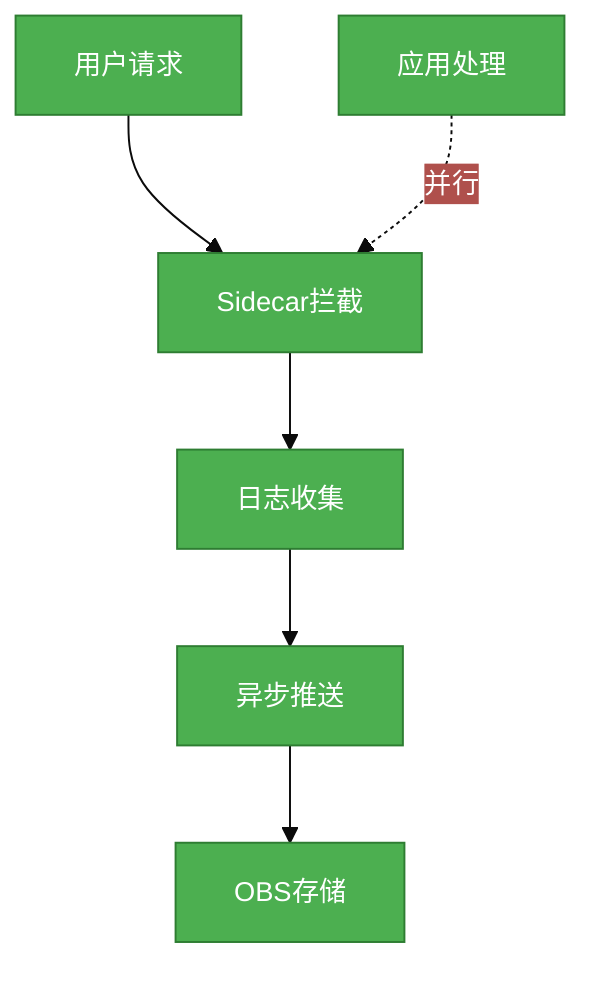

# #1 xx需求分析说明书

## 1. 基础信息

* **需求链接**: **[TODO]**
* **需求名称**: **[TODO]**_简明扼要的需求标题_
* **开发责任人**: **[TODO]**_githubid & gitcodeid_

---

## 2. 需求场景说明

> 描述“在什么情况下，为了解决什么问题，用户需要做什么”。

**场景说明:** **[TODO]**

## 3 需求验收标准

> 明确需求完成的标志，必须是可量化、可测试的。

**验收标准:** **[TODO]**

- [_如：经测试，SRE团队xx重复性工作耗时减少60%_]

---

## 4. 需求设计与分解

> 说明：基于初步方案，将需求拆解为可实施的原子 Task。后续的流程判定将严格依据这些 Task 的影响范围进行。

### 4.1 核心逻辑方案

> 简述实现逻辑（如：数据流向、模块改动、新增配置项等），作为任务拆解的理论依据。推荐使用Mermaid图表展示流程，支持GitHub原生渲染。

**逻辑方案:** **[TODO]** _如：通过 Sidecar 拦截流量，将访问日志异步推送至 OBS 存储。_

**流程图示例（使用Mermaid）：**

**说明：**
- 推荐使用Flowchart展示业务流程
- 推荐使用Sequence Diagram展示组件交互
- 推荐使用State Diagram展示状态转移
- 所有Mermaid代码直接嵌入Markdown，GitHub自动渲染
- 参考《架构设计说明书编写经验》第16-20章获取更多图表示例

### 4.2 任务清单

**任务清单:**

| 任务 ID              | 任务描述 (Task Description)            | 预期产出 (Deliverables) | 预期工作量（人天）    |
|--------------------|------------------------------------|---------------------|--------------|
| **task1 _如：#123_** | **[TODO]** *(如：定义 Sidecar 流量转发规则)* | 配置文件/代码             | **[TODO]** 5 |
| **task2 _如：#124_** | **[TODO]** *(如：配置 OBS 存储桶访问权限)*    | IAM Policy / Secret | **[TODO]** 6 |
| **task2 _如：#125_** | **[TODO]** *(如：编写日志脱敏处理逻辑)*        | 核心逻辑代码              | **[TODO]** 7 |

---

## 5. 需求相关性分析

> **操作说明**：根据上述拆解出的 Task，识别其变更行为。任何一项勾选为“是”：打上对应issue标签，必须执行对应的流程门禁。全部未勾选：该需求自动判定为轻量化特性，打上need_light标签。

### A. 安全相关性分析

> 若涉及以下任一项，打标 `need_security`标签，PR 必须关联特性issue的架构设计文档（含安全设计部分）**如勾选需要给出原因**。

**[TODO]**

* [ ] **边界变更**：新增公网端口、修改防火墙规则、变更网关配置。
* [ ] **凭证处理**：涉及密钥（Secret/Key）、Token、证书的存储或分发。
* [ ] **权限调整**：修改权限模型、服务账号（SA）权限或鉴权逻辑。
* [ ] **供应链**：引入新的第三方二进制文件、SDK 或重大版本依赖升级。
* [x] **隐私风险评估**：涉及用户个人数据（Email、手机号、IP、邮箱 等）的处理。
* [x] **AI使用**：涉及AIGC能力应用，并提供服务。

### B. 架构设计相关性分析

> 若涉及以下任一项，打标 `need_design`标签，PR 必须关联特性issue的架构设计文档。 **如勾选需要给出原因**。

**[TODO]**

* [ ] A环节判定需要完成安全设计
* [ ] 改变了现有系统的物理/逻辑拓扑
* [x] 新增或大幅修改对外暴露的 API/CLI 接口
* [x] 引入了新的中间件、数据库或三方核心组件 **[勾选必填]**_原因：如：引入了新的中间件、数据库或三方核心组件_

### C. 系统集成测试相关性分析

> *若涉及以下任一项，打标 `need_itest`标签，PR必须关联特性issue的测试策略和测试报告文档。 **如勾选需要给出原因**。

**[TODO]**

* [ ] 上述环节判定需要执行安全设计或架构设计。
* [ ] **跨组件影响**：变更会触发下游服务或关联系统的连锁反应（级联效应）。
* [ ] **核心组件管控**：含项目定级为 Core 的核心逻辑变更。
* [ ] **环境强依赖**：功能高度依赖内核参数、网络拓扑或特定的物理挂载。
* [ ] **端到端流程**：涉及从用户输入到持久化存储的全链路逻辑。

### D. 用户体验相关性分析

> 若涉及以下任一项，打标 `need_ux`标签，PR必须关联特性issue的用户体验设计文档。 **如勾选需要给出原因**。

**[TODO]**

* [ ] **交互逻辑变更**：涉及 Web 门户、控制台（Dashboard）或命令行工具（CLI）的交互流程调整。
* [ ] **感知性能变动**：变更可能显著影响页面的加载时间、同步请求的响应时延或异步任务的进度反馈。
* [ ] **文档与辅助能力**：涉及报错提示语、帮助中心链接、FAQ 或新功能的 Runbook 说明。
* [ ] **无障碍与多语种**：涉及国际化（i18n）支持、辅助功能或不同终端（移动端/桌面端）的适配。

### 5.1 需求相关性分析汇总结果

**[TODO]**

* [ ] need_security (需架构设计（含安全威胁分析和安全设计）)
* [ ] need_design (需架构设计)
* [ ] need_itest (需执行测试策略设计和全链路集成测试)
* [ ] need_ux (需架构设计（含UX设计)）
* [ ] need_light (上述均未勾选，走快速合入通道)

---

## 6. 价值识别与业务评估

> **判定准则**：基础设施接纳需求必须具备明确的 ROI（投资回报比）或合规必要性。

| 维度        | 评估问题                            | 结论/说明               |
|-----------|---------------------------------|---------------------|
| **范围判定**  | 该需求是否属于基础设施范围内？                 | **[TODO]**_[是/否]_   |
| **规划一致性** | 该需求是否是否在年度技术规划中？                | **[TODO]**_[是/否]_   | 
| **优先级**   | 该需求优先级评估（高/中/低）？                | **[TODO]**_[高/中/低]_ | 
| **通用性**   | 该需求是否解决 3 个以上业务方的共性痛点？          | **[TODO]**_[是/否]_   |
| **必要性**   | 现有组件通过配置变更是否无法实现目标或没有不用开发的替代方案？ | **[TODO]**_[是/否]_   | 
| **工作量**   | 预计总工作量 **[TODO]** xx 人天？        | **[TODO]** _xx 人天_  | 
| **价值评估**  | 实现后能减少多少手动操作或提升多少系统稳定性？         | **[TODO]**_[具体说明]_  |

> **状态定义：** **Accept (准入)** | **Reject (驳回)** |  **Pending (待议)**

**建议结论**： **[TODO]** _如：Accept_

**原因描述:** **[TODO]**  _如：该需求通过自动化配置同步，预计可减少 SRE 团队每周 4
小时的重复性手动核对工作，且符合“配置即代码”的演进目标。_

---
