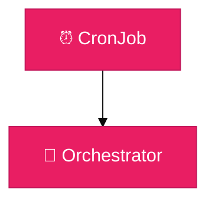
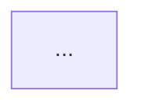
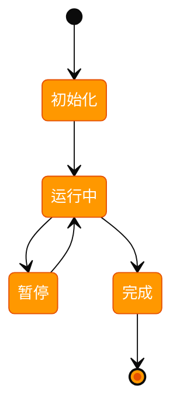
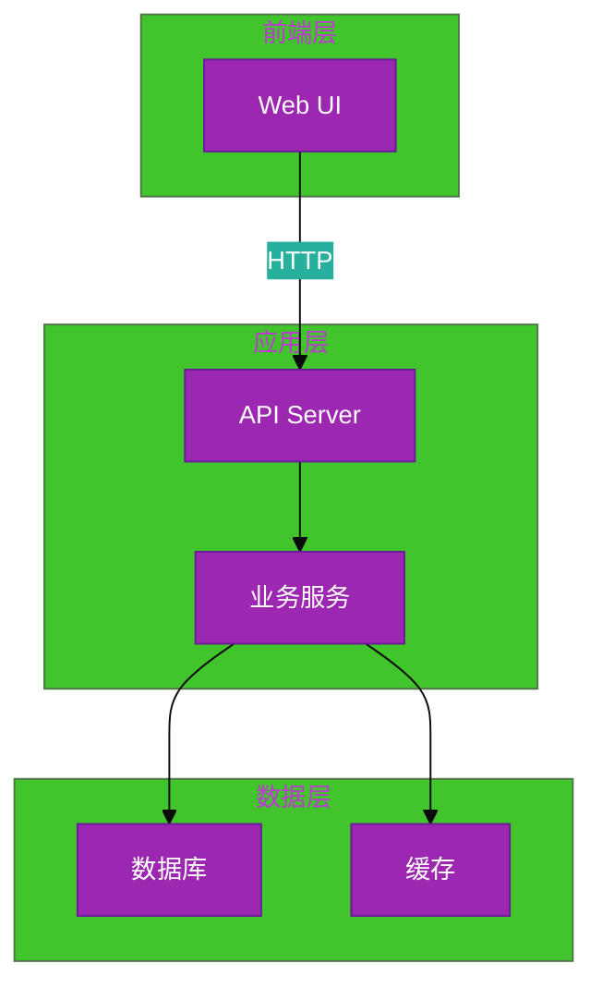
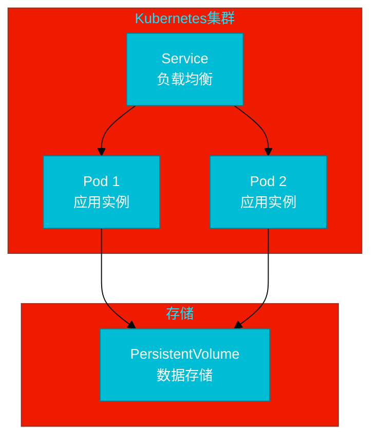
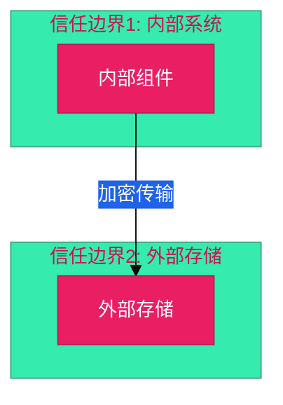

# 架构设计说明书编写经验

## 关键要点

### 1. 保留模板所有章节和引导提示

- 模板中的 `>` 引用块必须保留
- 不涉及的章节保留结构，标注"不涉及，原因：xxx"
- 不要删除任何章节，即使完全不涉及

### 2. need_security 时安全设计（3.1）为必填

- 3.1.1 威胁分析：基于 STRIDE 模型，识别与本需求相关的具体威胁场景
- 3.1.2 安全设计实现：针对模板参考问题，回答适用的项目即可，不必所有参考项都回答
- 3.1.3 安全任务分解：将安全设计转化为具体的开发任务

### 3. 非功能设计 3.2-3.4 为可选

- 可靠性（3.2）：仅 Core/Critical 服务需要
- 可服务性（3.3）：长驻服务需要，批处理脚本可标注不涉及
- 性能（3.4）：有高并发或扩展需求时填写
- 不涉及时保留章节结构，写明原因

### 4. 功能设计要清晰

- 架构图：建议用文本描述组件关系 + draw.io 图归档
- 组件职责：表格形式比纯文字更清晰（组件名/职责/输入输出）
- UX/SOD：工具类需求通常不涉及，写明原因即可

### 5. 安全扫描类需求的特殊关注点

- 威胁分析重点：扫描结果泄露、扫描行为被利用、清单被篡改
- 并发控制：避免扫描对目标服务造成压力
- 日志脱敏：不记录完整响应体，避免敏感信息泄露
- 报告访问控制：限制报告文件权限，不推送到公开仓库

### 6. 架构图归档

- 文本描述（ASCII/Markdown）可作为初版，但应补充 draw.io 设计图归档
- Threat Dragon 数据流图和威胁分析报告图也应归档
- 建议使用 SVG 格式保存（可预览、可导入复用）

## 实践案例：Issue #178 统一账号服务删除账号验证码验证

### 架构设计特点

- **类型**：账号安全加固类（OTP验证流程插入）
- **重点**：OTP 凭证存储安全、一次性使用、频率限制、日志脱敏
- **复杂度**：低中（现有架构基础上新增2个接口 + Redis OTP存储）

### 编写要点总结

#### 1. 时序图比架构图更适合描述验证流程

- 多方交互（前端→API→Redis→通知服务→用户）用 `sequenceDiagram` 最清晰
- 时序图可以同时展示正常流和异常分支（OTP校验失败路径）

#### 2. OTP 安全设计的 STRIDE 覆盖重点

- **权限提升**：绕过OTP直接调用删除接口（最高风险）
- **信息泄露**：OTP明文出现在日志中
- **拒绝服务**：批量调用OTP发送接口耗尽通知配额
- **暴力破解**：6位数字OTP的枚举攻击（100万种）
- **重放攻击**：已使用OTP的重复提交
- **隐私泄露**：响应中暴露完整联系方式

#### 3. 接口定义要明确错误码语义

- 400 invalid_otp：OTP错误或过期
- 423 otp_locked：超过错误次数限制
- 429 rate_limit_exceeded：发送频率超限
- 分别对应不同的安全控制策略，错误码要有区分

#### 4. 非功能设计的快速判断

- 账号操作类需求通常：可靠性/可服务性/性能 三项均不涉及
- 直接标注"不涉及，原因：低频用户自助操作/复用现有体系"即可

---

## 实践案例：Issue #67 LTS日志敏感信息扫描

### 架构设计特点

- **类型**：安全扫描工具类需求
- **重点**：凭证管理、数据加密、访问控制、日志脱敏
- **复杂度**：中等（多云账号、多个处理阶段）

### 编写要点总结

#### 1. 安全扫描类需求的架构设计重点

- **凭证管理层**：独立设计，从Secret Store读取，不硬编码
- **加密层**：报告使用AES-256加密，传输使用TLS 1.2+
- **审计层**：脱敏日志记录，不记录完整敏感信息
- **访问控制**：OBS结果桶严格权限设置

#### 2. 威胁分析的STRIDE应用

- **信息泄露**：凭证泄露、扫描结果泄露、日志泄露（3个威胁）
- **篡改/伪造**：扫描结果被篡改（1个威胁）
- **拒绝服务**：扫描服务过载（1个威胁）
- **权限提升**：任务权限过高（1个威胁）
- **隐私泄露**：临时文件泄露（1个威胁）
- 每个威胁都有对应的减缓措施

#### 3. 组件职责表的设计

- 表格形式比纯文字更清晰
- 包含：组件名称、职责、输入、输出、接口/方法
- 便于后续开发和测试参考

#### 4. 非功能设计的取舍

- **可靠性**：不涉及（批处理任务，无需高可用）
- **可服务性**：不涉及（无长驻服务）
- **性能**：不涉及（无高并发要求）
- 明确写出"不涉及，原因：xxx"，保留模板结构

#### 5. 安全设计实现的参考问题回答

- 不必所有参考问题都回答，仅回答适用的项目
- 凭证管理、数据安全、运行时隔离、日志审计、访问控制都有具体实现
- 每项实现都对应威胁分析中的减缓措施

#### 6. 安全任务分解的细粒度

- SEC-TASK1-6 共6个安全相关任务
- 与功能TASK1-7 共7个功能任务
- 安全任务与功能任务并行执行，不是串行依赖

## Mermaid图表嵌入最佳实践（GitHub原生方案）

### 7. 推荐方案：使用Mermaid主题系统（GitHub原生渲染）

这是当前最优方案，基于Issue #67实践总结和业界调查。

**核心原理：不要hardcode颜色**

- ❌ 避免：`style NodeName fill:#color` - 这会覆盖GitHub的自动深浅模式适配
- ✅ 推荐：使用 `%%{init}%%` 块定义主题变量 - 让Mermaid和GitHub自动适配

**优点**

- ✅ GitHub原生支持，深浅模式自动适配
- ✅ 文本格式，易于版本控制和diff审查
- ✅ 可直接编辑，修改立即生效
- ✅ 无网络依赖，自动渲染
- ✅ Mermaid自动计算派生颜色（边框、阴影等）
- ✅ 一处配置，整个图表统一应用

**实现方式**



**Issue #67实践成果**

- 6个主要图表已改用主题系统
- 消除了所有hardcode样式
- 深浅模式对比度问题彻底解决

### 8. 威胁建模中的信任边界设计（关键实践）

**三层信任边界模型**

1. **信任边界1：Kubernetes集群内部**
   - 受信任执行环境
   - Kubernetes RBAC保护
   - 网络隔离
   - **包含内容**：所有容器执行过程（编排、扫描、加密、上传等）

2. **信任边界2：外部OBS存储**
   - 不完全受信任
   - 网络通信暴露
   - 云服务提供商控制
   - **包含内容**：日志桶、结果桶、审计日志

3. **外部交互者**
   - 完全不信任
   - 运维人员、攻击者
   - **入口点**：ConfigMap配置变更、OBS数据访问

**关键跨越点识别**

| 数据流           | 起点           | 终点      | 风险等级 | 缓解措施             |
| ---------------- | -------------- | --------- | -------- | -------------------- |
| **日志数据**     | 容器           | OBS日志桶 | 🔴高     | TLS 1.3、IAM控制     |
| **加密报告上传** | 上传器(容器内) | OBS结果桶 | 🔴高     | HMAC签名、AES-256    |
| **凭证读取**     | Secret         | CredMgr   | 🔴高     | 启动后删除、内存加密 |
| **配置变更**     | 运维           | ConfigMap | 🔴高     | RBAC、不可变         |

**常见设计错误**

- ❌ 把上传器放在容器外 → 正确做法：上传器在容器内执行（属于信任边界1）
- ❌ 忽略跨越信任边界的数据流 → 正确做法：这些是高风险点，需要重点防御
- ❌ 信任边界模糊 → 正确做法：明确划分，用subgraph清晰展示

### 8. 备选方案：外部图片引用（仅在必要时使用）

在特殊场景下才考虑转换为图片。

**何时使用图片**

- 需要在GitHub外的地方展示（PDF报告、PPT演示）
- 需要高度自定义样式（Mermaid无法实现）
- 需要在不支持Mermaid的平台使用

**转换工具选择**

| 工具         | 优点             | 缺点          | 使用场景   |
| ------------ | ---------------- | ------------- | ---------- |
| GitHub原生   | 零配置，完全支持 | 无法导出      | 日常开发   |
| mermaid.live | 实时预览，易导出 | 需手工下载    | 偶尔导出   |
| Mermaid CLI  | 批量转换，离线   | 需安装Node.js | 大量导出   |
| Kroki.io     | 支持多格式，在线 | 网络依赖      | 自动化流程 |

**推荐工具：mermaid.live**

1. 访问 https://mermaid.live
2. 粘贴Mermaid代码
3. 实时预览效果
4. 点击导出为PNG/SVG/PDF

### 9. Mermaid图表设计最佳实践

**通用设计原则**

- 使用分层结构（subgraph）清晰表示系统组织
- 彩色编码不同组件类型，便于区分
- 使用 `<br/>` 换行，标注每个组件的功能说明
- 实线表示主数据流（`-->`），虚线表示辅助流（`-.->`)
- 标签清晰简洁，避免过长

**架构图设计**

- 分层递进展示：触发层 → 编排层 → 凭证层 → 处理层 → 存储层 → 审计层
- 使用subgraph分组逻辑单元
- 彩色突出核心组件（如凭证管理、加密等）
- Issue #67示例：8层架构，9个核心组件

**数据流图设计**

- 从左到右或上到下的序列流
- 清晰标注每个阶段的输入/输出
- 突出安全处理环节（如凭证清理、加密）
- 虚线表示审计和监控流
- Issue #67示例：5个阶段，涵盖输入→清理→处理→输出→审计

**威胁模型图设计**

- 展示威胁分布和分类（STRIDE维度）
- 映射威胁到具体防御措施
- 彩色编码：红色(高风险)、黄色(中风险)、绿色(防御)
- 使用矩阵式或分组式展示
- Issue #67示例：16个威胁 + 6个STRIDE类别 + 24个防御措施

**部署架构图设计**

- 展示Kubernetes资源（Pod、Secret、ConfigMap、PVC等）
- 标注资源间的关系和挂载点
- 区分内部资源和外部服务
- 清晰表示数据流和依赖关系
- Issue #67示例：K8s集群与OBS存储的完整拓扑

### 10. 彩色编码规范（高对比度方案）

**推荐Mermaid彩色方案** ⭐ 基于WCAG AA标准，确保黑色文字清晰可读

```
【关键/威胁】
- 高风险威胁：#ff4444 (深红) - 鲜艳红色，警示强烈
- 攻击者：#d32f2f (更深红) - 强调危险

【功能层级】
- 触发/定时：#ff6b6b (亮红) - CronJob层
- 编排/控制：#ff9800 (深橙) - Orchestrator层
- 凭证/安全：#e91e63 (深粉) - CredMgr层
- 处理/业务：#2196f3 (深蓝) - LogScanner等处理层
- 报告/加密：#9c27b0 (深紫) - Encryptor、ReportGen
- 存储/输出：#4caf50 (深绿) - OBSResults、存储桶

【运维/监控】
- 审计/监控：#00bcd4 (深青) - 审计日志、监控
- 配置：#ff5722 (深褐) - ConfigMap
- 日志：#673ab7 (深紫) - LogSystem

【防御层级】
- P1高优先级防御：#4caf50 (深绿) - 关键防御
- P2中优先级防御：#8bc34a (青绿) - 次要防御
```

**使用示例**

```mermaid
style CronJob fill:#ff6b6b
style Orchestrator fill:#ff9800
style CredMgr fill:#e91e63
style LogScanner fill:#2196f3
style Encryptor fill:#9c27b0
style OBSResults fill:#4caf50
style AuditLogs fill:#00bcd4
```

**颜色选择原则**

- ✅ 使用WEB安全色和Material Design配色
- ✅ 深色背景+黑色文字对比度>7:1（远超WCAG AA）
- ✅ 避免浅色系（#ffcccc、#ffffcc等低对比度）
- ✅ 不同类型功能用完全不同的色调，易于区分

### 11. Mermaid文档结构建议

**推荐章节安排**

````markdown
### 2.1 架构图

**设计说明/归档：**

**系统架构分层图**：


````

**架构说明：**

- **定时任务层**：...
- **编排层**：...
- ...

````

**关键点**
- 副标题："设计说明/归档" - 表示本节有设计文档支持
- Mermaid代码块前用中文标题说明图表内容
- 架构说明用列表详细解释每一层或每个组件
- 文字说明和图表相辅相成，不重复

### 12. 多图表管理最佳实践

**按功能分类嵌入图表**

**第2章 - 功能设计**
- 2.1 架构图（系统分层视图）
- 2.2 数据流图（业务流程）
- 2.3 组件接口（时序和交互）
- 2.6 WBS（工作分解）
- 2.7 部署架构（Kubernetes拓扑）

**第3.1章 - 安全设计**
- 3.1.2 安全防御机制（6层防御视图）
- 3.1.4 威胁建模（6个详细威胁模型图）

**Issue #67实现**
- 总计12个Mermaid图表
- 全部自包含在一个Markdown文件中
- 无外部依赖，无图片文件

### 13. 常见问题与解决

**问题1：GitHub显示"Loading..."**
- 正常现象，稍等即可
- 如长时间未加载，刷新页面
- 检查Mermaid代码是否有语法错误

**问题2：本地Markdown预览看不到**
- 本地编辑器可能不支持Mermaid
- 使用支持Mermaid的编辑器（VS Code + Mermaid扩展）
- 或访问GitHub查看最终效果

**问题3：图表显示不完整**
- 简化图表，减少节点数
- 使用更简洁的标签
- 分解为多个小图表
- Issue #67使用了复杂图表但通过精心设计避免了此问题

**问题4：需要导出为图片**
- 使用mermaid.live在线编辑器导出
- 或使用npm工具：`npm install @mermaid-js/mermaid-cli`

### 14. 版本管理与增量迭代

**文本版本控制优势**
- 所有修改都通过Git追踪
- 可查看每次修改的diff
- 易于review和回滚
- 支持分支和合并

**增量更新流程**
1. 在Markdown中直接修改Mermaid代码
2. 本地预览（mermaid.live或编辑器扩展）
3. commit并push
4. GitHub自动渲染新版本
5. 无需管理图片文件版本

### 15. 架构设计文档检查清单（新）

- [x] 所有Mermaid代码直接嵌入Markdown
- [x] 无外部图片文件依赖
- [x] 每个Mermaid代码块有中文标题说明
- [x] 每个图表都有对应的文字说明
- [x] 彩色编码一致且符合逻辑
- [x] 代码无语法错误（GitHub渲染正常）
- [x] 文档自包含，零外部依赖
- [x] 所有图表都经过GitHub预览验证
- [x] Markdown文档结构清晰，易于导航
- [x] 支持版本控制和diff审查

## 需求分析中的Mermaid图表应用

### 16. 需求分析文档中的图表位置

**4.1 核心逻辑方案** - 推荐使用Mermaid图表

此处应该用图表展示需求的核心逻辑流程，而不仅仅是文字描述。

**推荐图表类型：**

1. **流程图（Flowchart）** - 展示业务流程
```mermaid
%%{init: {
  'theme': 'base',
  'themeVariables': {
    'primaryColor': '#4caf50',
    'primaryBorderColor': '#2e7d32',
    'primaryTextColor': '#ffffff',
    'fontSize': '14px'
  }
}}%%
flowchart TD
    A["用户请求"] --> B["系统处理"]
    B --> C["数据存储"]
    C --> D["返回结果"]
````

2. **时序图（Sequence Diagram）** - 展示组件间交互

```mermaid
%%{init: {
  'theme': 'base',
  'themeVariables': {
    'primaryColor': '#2196f3',
    'primaryBorderColor': '#1565c0',
    'primaryTextColor': '#ffffff',
    'fontSize': '14px'
  }
}}%%
sequenceDiagram
    participant Client
    participant Server
    participant Database
    Client->>Server: 请求数据
    Server->>Database: 查询
    Database-->>Server: 返回结果
    Server-->>Client: 响应
```

3. **状态图（State Diagram）** - 展示状态转移



**优点：**

- 比纯文字更直观
- 易于理解复杂流程
- 便于需求评审和沟通
- 支持版本控制

### 17. 架构设计中的Mermaid图表应用

**2.1 架构图** - 系统组件拓扑

推荐使用图表展示系统的物理或逻辑架构，包括组件、依赖关系、通信方式。

**推荐图表类型：**

1. **组件图（Graph/Flowchart）** - 展示系统组件和依赖



2. **部署图（Deployment）** - 展示部署拓扑



**2.2 数据流图** - 核心业务数据生命周期

这是威胁建模的基础，必须用图表展示。

**推荐图表类型：**

1. **数据流图（DFD）** - 展示数据流向和处理


**3.1.1 威胁分析** - 威胁建模可视化

必须包含DFD和信任边界，用图表展示系统的安全边界和数据流。

**推荐图表类型：**

1. **信任边界图** - 展示安全边界



### 18. Mermaid图表的彩色编码规范

**推荐配色方案（Material Design）：**

| 用途      | 颜色 | primaryColor | primaryBorderColor | 说明     |
| --------- | ---- | ------------ | ------------------ | -------- |
| 流程/业务 | 绿色 | #4caf50      | #2e7d32            | 正常流程 |
| 数据/存储 | 蓝色 | #2196f3      | #1565c0            | 数据相关 |
| 状态/转移 | 橙色 | #ff9800      | #e65100            | 状态变化 |
| 安全/威胁 | 红色 | #f44336      | #c62828            | 安全相关 |
| 架构/部署 | 紫色 | #9c27b0      | #6a1b9a            | 系统架构 |
| 网络/通信 | 青色 | #00bcd4      | #00838f            | 网络相关 |
| 用户交互  | 粉色 | #e91e63      | #c2185b            | 用户界面 |

**使用规则：**

- 同一文档中相同类型的图表使用相同配色
- 不同类型的图表使用不同配色便于区分
- 保持配色一致性，便于读者快速识别

### 19. 图表编写最佳实践

**DO（应该做）：**

- ✅ 为每个图表添加中文标题和说明
- ✅ 使用有意义的节点标签（中文或英文清晰表达）
- ✅ 使用emoji增强可读性（如📥📤⚙️💾等）
- ✅ 保持图表简洁，避免过多节点
- ✅ 使用主题系统而不是hardcode颜色
- ✅ 在图表下方添加文字说明和关键点解释

**DON'T（不应该做）：**

- ❌ 不要使用hardcode的style fill:#color
- ❌ 不要创建过于复杂的图表（超过20个节点）
- ❌ 不要使用不清晰的缩写或代码
- ❌ 不要忽略图表的文字说明
- ❌ 不要混用多种配色方案

### 20. 常见图表类型选择指南

| 需求场景     | 推荐图表类型     | 文件位置       | 示例                               |
| ------------ | ---------------- | -------------- | ---------------------------------- |
| 业务流程展示 | Flowchart        | 需求分析 4.1   | 用户请求 → 系统处理 → 返回结果     |
| 组件交互     | Sequence Diagram | 架构设计 2.1   | 客户端 → 服务器 → 数据库           |
| 系统架构     | Graph/Flowchart  | 架构设计 2.1   | 前端 → 应用 → 数据库               |
| 数据流向     | DFD              | 架构设计 2.2   | 数据源 → 处理 → 存储               |
| 威胁建模     | DFD + 信任边界   | 架构设计 3.1.1 | 内部系统 ↔ 外部存储                |
| 状态转移     | State Diagram    | 需求分析 4.1   | 初始化 → 运行中 → 完成             |
| 部署拓扑     | Graph            | 架构设计 2.1   | Kubernetes Pod → Service → Storage |

## 实践案例：Issue #148 GitHub CI Workflow 指标采集

### 架构设计特点

- **类型**：数据采集工具类需求
- **重点**：配置驱动、GitHub API、数据聚合
- **复杂度**：中等

### 编写要点总结

#### 1. Mermaid 图表必须使用主题系统

- ❌ 禁止使用 `style NodeName fill:#color` hardcode 颜色
- ✅ 使用 `%%{init}%%` 主题系统定义配色
- 原因：GitHub 深浅模式自动适配，对比度问题彻底解决

#### 2. 安全章节不可删除，即使不涉及

- 3.1 章节"安全与隐私设计"必须保留
- 不涉及时标注原因："需求分析判定无安全相关性"
- 保持模板完整性，便于后续维护

#### 3. 非功能设计章节结构

- 3.1 安全与隐私设计（`need_security`时必填）
- 3.2 可靠性与韧性设计
- 3.3 可服务性与可观测性
- 3.4 性能与伸缩性
- 3.5 测试覆盖设计
- 编号不可错乱，保持模板结构
