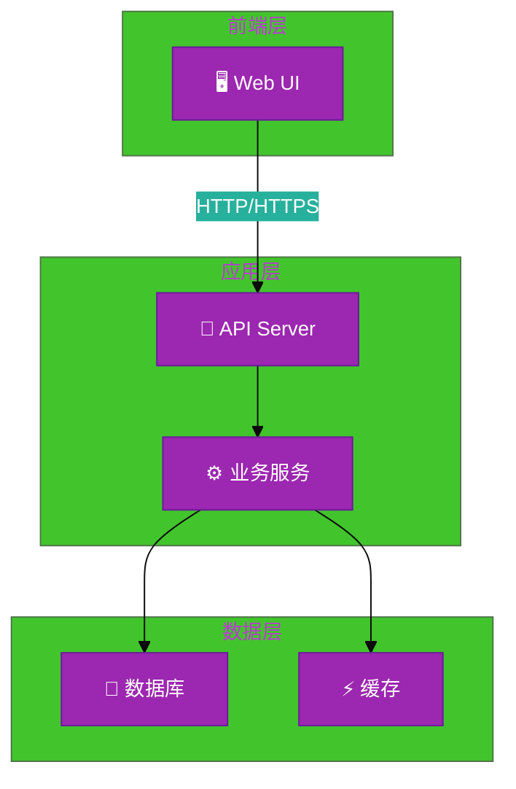
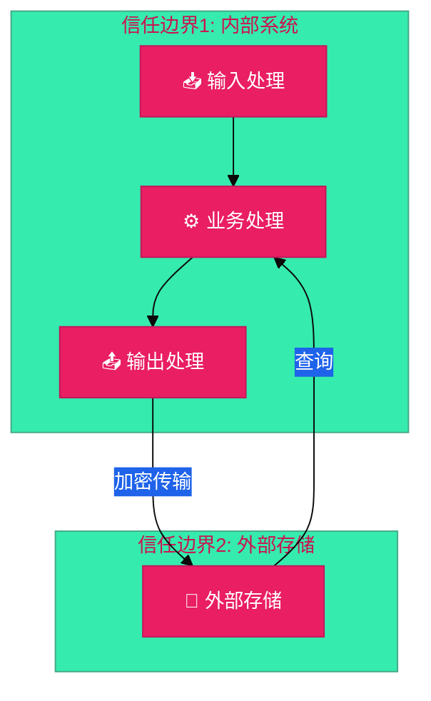

# #1 xx 架构设计说明书 (Architecture Design Document)

---

## 1. 基础信息

- **需求链接**: **[TODO]**
- **需求名称**: **[TODO]**_简明扼要的需求标题_
- **开发责任人**: **[TODO]**_githubid & gitcodeid_
- **设计目标**: **[TODO]**_简述通过何种技术手段实现需求。_

---

## 2. 功能设计

> **说明**：描述系统的组件构成、职责划分及交互逻辑。

### 2.1 架构图

> 此处建议插入架构拓扑系统组件图或时序图，描述组件间的交互关系。推荐使用Mermaid实现，可代码化，GitHub可渲染。
> **不涉及需要说明原因**

**设计说明/归档：** **[TODO]**

**架构图示例（使用Mermaid）：**

**说明：**

- 推荐使用Graph展示系统组件和依赖关系
- 使用subgraph分组相关组件
- 使用emoji增强可读性
- 标注通信协议和数据流向

### 2.2 数据流图

> 此处建议插入数据流图，描述核心业务数据的生命周期，即威胁建模的基础。推荐使用Mermaid实现，可代码化，GitHub可渲染。
> **不涉及需要说明原因**

**设计说明/归档：** **[TODO]**

**数据流图示例（使用Mermaid）：**

**说明：**

- 推荐使用DFD展示数据流向和处理步骤
- 标注数据在各阶段的转换和处理
- 识别数据的来源、处理、存储和输出
- 为威胁建模和安全设计提供基础

### 2.3 组件职责与接口

> 列出新增/修改的组件及其定义的 API 规范。**不涉及需要说明原因**

**设计说明/归档：** **[TODO]**

### 2.4 UX设计

> 设计目标：确保功能不仅“可用”，而且“好用”，降低开发者的认知负担和运维人员的误操作风险。 **不涉及需要说明原因**

**设计说明/归档：** **[TODO]**

### 2.5 SOD设计

> 设计目标：通过维护SOD权限设计文档，确保权限设计可审计、可复用、可跨服务重用。 SOD权限设计参考[XX SOD权限设计.md](XX%20SOD%E6%9D%83%E9%99%90%E8%AE%BE%E8%AE%A1.md)
>
> **不涉及需要说明原因**
>
> **需要说明文档位置**

**设计说明/归档：** **[TODO]**

### 2.6 功能设计分解TASK清单

**设计说明/归档：**

**任务清单:**
_如：_

| 任务 ID            | 可服务性任务描述                                                        | 责任人 |
| ------------------ | ----------------------------------------------------------------------- | ------ |
| **TASK1 _如#123_** | **[TODO]** _如：API/UI 交互原型评审：完成字段定义或 UI 流程图_          | [TODO] |
| **TASK2 _如#124_** | **[TODO]** _如：易用性走测：邀请一名非项目组成员进行“零文档”操作演练。_ | [TODO] |

---

## 3. 非功能设计

### 3.1 安全与隐私设计评估和设计

> **注意**：仅当需求判定为 **`need_security`** 时，本章节为必填项。 **无该标签可删除本章节。**

> 关注点：防御能力与合规边界。

### 3.1.1 威胁分析 (Threat Modeling)

> 基于 **STRIDE** 或类似模型，识别本项目可能面临的安全威胁。推荐使用Mermaid绘制DFD数据流图和信任边界，展示系统的安全边界和数据流向。
> **建议归档服务模块设计图，后续需要可增量复用（导入设计文件到工具中即可复用增量设计）。**

**设计说明/归档：** **[TODO]**

**威胁建模图示例（使用Mermaid DFD）：**

**说明：**

- 使用subgraph标注信任边界
- 标注跨越信任边界的数据流
- 识别高风险的数据流向
- 为STRIDE威胁分析提供基础

**威胁分析表：**

_如：_

| 威胁类别      | 攻击场景描述 (Scenario)                                  | 风险等级/评分 | 对应减缓措施 (Mitigation)        |
| ------------- | -------------------------------------------------------- | ------------- | -------------------------------- |
| **信息泄露**  | **[TODO]** _如：攻击者通过 API 暴力破解获取用户敏感凭证_ | 高            | 增加限流机制、强制 MFA 校验      |
| **篡改/伪造** | **[TODO]** _如：伪造回调请求非法提升社区权限_            | 高            | 引入请求签名校验与 Hmac 验证     |
| **隐私泄露**  | **[TODO]** _如：日志中打印了明文Token_                   | 中            | 实现日志脱敏过滤器 (Log Masking) |

**参考资料：**

- 详见《架构设计说明书编写经验》第8章：威胁建模中的信任边界设计
- 详见《架构设计说明书编写经验》第16-20章：Mermaid图表应用指南

### 3.1.2 安全设计实现 (Security Mechanisms)

> **参考：**
> 威胁模型评估：
>
> - 是否已根据业务逻辑绘制 Data Flow Diagram 并识别单点风险？
>
> 软件供应链：
>
> - 是否扫描并修补了已知漏洞（CVE）？
> - 是否限制了第三方二进制包的直接引入？
> - 凭证管理：
> - 严禁硬编码。
> - 密钥是否定期自动轮转（Rotation）？
>
> 身份认证：
>
> - 是否具备多因素认证支持或联邦认证（OIDC）对接能力？
> - 内部微服务调用是否执行了身份校验（Identity-based Auth）？
>
> 数据安全：
>
> - 传输加密（TLS 1.2+）与静态加密（AES-128）是否全覆盖？
> - 是否对高敏感字段（如手机号、秘钥）执行了哈希/加盐或差分隐私处理？
>
> 运行时隔离：
>
> - 容器是否以非 Root 用户运行（Non-root Enforcement）？
> - 是否配置了 Read-only Root Filesystem 防止二进制篡改？
>
> 日志审计：
>
> - 关键操作日志是否具备防篡改性？
> - 是否包含了足够用于追溯的 4W 信息（Who, When, Where, What）？

**设计说明/归档：** **[TODO]**

_如：_

- **身份认证与授权**：描述如何验证身份（如 JWT, OIDC）及 RBAC 权限控制。
- **数据安全**：描述传输加密（TLS 1.3）与持久化加密策略。
- **边界防御**：描述对输入参数的强校验逻辑（防注入）。

### 3.1.3 安全任务分解 (Security Task Breakdown)

> 将安全设计转化为具体的开发任务，需在代码或后续开发流程的安全配置中落实。

**任务清单:**
_如：_

| 任务 ID            | 安全任务描述 (Security Tasks)                                | 责任人 |
| ------------------ | ------------------------------------------------------------ | ------ |
| **TASK1 _如#123_** | **[TODO]** 实现 API 请求的鉴权中间件。                       | a      |
| **TASK2 _如#124_** | **[TODO]** 配置 Secret Store (如 Vault) 动态读取数据库密码。 | b      |
| **TASK3 _如#125_** | **[TODO]** 编写脱敏正则，覆盖日志输出模块。                  | c      |

### 3.2 可靠性与韧性设计评估和设计（可选）

> **注意**：根据项目定级决定，含Core、Critical服务变更需要完成

> **关注点**：极端情况下的生存与恢复能力。
> **参考：**
>
> - 面向失败设计：是否识别了强依赖风险？当游依赖失效时，本服务是否具备降级或熔断能力？
> - 重试与避让：重试逻辑中是否包含指数退避和随机抖动以防止请求风暴？
> - 熔断限流：核心接口是否定义了明确的限流阈值？是否实现了断路器模式以保护下游？
> - 幂等设计：所有涉及写操作的任务是否支持重复调用而无副作用？

**设计说明/归档：** **[TODO]**

**任务清单:**

_如：_

| 任务 ID            | 可靠性与韧性任务描述                                    | 责任人 |
| ------------------ | ------------------------------------------------------- | ------ |
| **TASK1 _如#123_** | **[TODO]** _如：实现全局限流中间件，防止下游数据库过载_ | a      |
| **TASK1 _如#123_** | **[TODO]** _如：配置主备多机房高可用部署架构_           | b      |

---

### 3.3 可服务性与可观测性评估和设计（可选）

> **关注点**：排障效率与全生命周期管理，确保故障可感知、可定位、可修复。

> **参考：**
>
> - 排障文档：是否提供了错误码对照表及对应的排障步骤？
> - 健康诊断：是否提供 /health 或 /status 接口，展示系统内部子模块的状态？
> - 平滑变更：升级或配置变更时如何实现灰度发布？是否具备一键回滚的判定指标？
> - 黄金指标覆盖：是否已定义并暴露出延迟、错误、流量和饱和度指标？

**设计说明/归档：** **[TODO]**

**任务清单:**

_如：_

| 任务 ID            | 可服务性任务描述                                               | 责任人 |
| ------------------ | -------------------------------------------------------------- | ------ |
| **TASK1 _如#123_** | **[TODO]** _如：增加详细的排障错误码（Error Codes）及映射指南_ | [TODO] |
| **TASK2 _如#124_** | **[TODO]** _如：开发核心数据的清理与一致性检查脚本_            | [TODO] |

---

### 3.4 性能与伸缩性评估和设计（可选）

> **关注点**：社区生态兼容性与未来扩展。

> **参考：**
>
> - 并发模型：在高并发场景下，锁竞争、连接池和线程池的配置是否已评估？
> - 水平扩展：服务是否实现了完全无状态化，支持快速扩容？
> - 延迟评估：关键路径的延迟是否业务需求？是否存在明显的 IO 或计算瓶颈？

**设计说明/归档：** **[TODO]**

**任务清单:**

_如：_

| 任务 ID            | 性能任务描述                                                | 责任人 |
| ------------------ | ----------------------------------------------------------- | ------ |
| **TASK1 _如#123_** | **[TODO]** _如：执行针对核心数据库查询的索引优化及压力测试_ | [TODO] |

---
